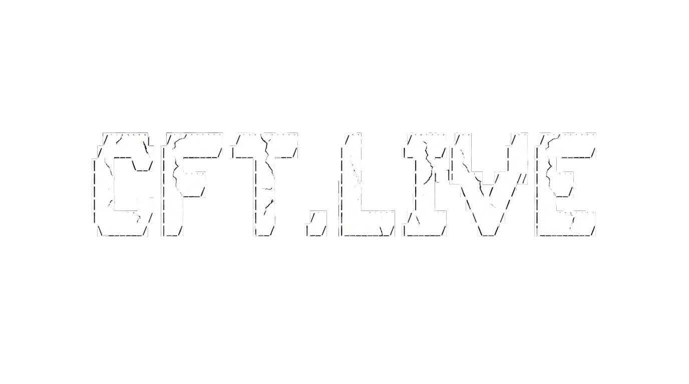

<p align="center">
	
</p>

<h1 align="center">CFT.live</h1>

<p align="center">
	<strong>Smart contract products, Web3 tools, and a contributor economy under one platform.</strong>
</p>

<p align="center">
	<a href="https://www.cft.live/">Website</a>
	·
	<a href="./WHITEPAPER.md">Project Whitepaper</a>
	·
	<a href="./LICENSE">License</a>
</p>

---

## What Is CFT.live?

CFT.live is a Web3 platform for hosting smart contract products and related tools through a single public-facing service layer.

Instead of treating smart contracts as isolated deployments, CFT.live wraps them in a broader product system: frontend access, operational services, contributor workflows, and transparent reward distribution. The project is built around a simple idea: platform usage creates value, and contributors who help build the platform should be able to share in that value through CFT rewards and USDC redemption.

Live site: https://www.cft.live/

## Quick Links

- Website: https://www.cft.live/
- Project whitepaper: [WHITEPAPER.md](./WHITEPAPER.md)
- Frontend app: [client/](./client/)
- Backend services: [backend/](./backend/)
- Workers: [workers/](./workers/)
- Smart contracts: [smartcontracts/](./smartcontracts/)
- License: [LICENSE](./LICENSE)

## Whitepapers

### Platform

- [CFT.live Project Whitepaper](./WHITEPAPER.md)

### Smart Contract Papers

- [CFT Token System Whitepaper](./smartcontracts/cft-token/WHITEPAPER.md)
- [CFT Prediction Market Whitepaper](./smartcontracts/prediction/WHITEPAPER.md)
- [CFT Lotto Whitepaper](./smartcontracts/lotto/WHITEPAPER.md)
- [CFT Roulette Whitepaper](./smartcontracts/roulette/WHITEPAPER.md)

## Project Structure

| Area | Purpose |
| --- | --- |
| [client/](./client/) | Public web application and contributor-facing product experience |
| [backend/](./backend/) | Operational APIs and data workflows for platform management |
| [workers/](./workers/) | Supporting services for automation, scheduling, and live platform utilities |
| [smartcontracts/](./smartcontracts/) | On-chain protocol and token systems, plus contract-specific documentation |

## How The Platform Fits Together

### 1. Product Layer

Users interact with CFT.live through the website and app surfaces that make the platform's smart contract tools accessible.

### 2. Operations Layer

Supporting backend services and workers handle the platform logic around coordination, background tasks, and product usability.

### 3. Settlement Layer

Smart contracts handle on-chain execution, contributor token distribution, and redemption flows on Arbitrum.

### 4. Contributor Layer

Work is organized into Features, Tasks, and Contributions. Approved work earns CFT rewards, and the broader platform model is designed so contributors can later convert earned CFT into USDC.

## Contributor-Aligned Model

The project is built around a contribution economy rather than a closed development model.

- contributors help ship platform improvements
- approved work earns CFT rewards
- platform revenue is intended to strengthen the backing behind CFT redemption
- contributors can redeem CFT for USDC through the broader token system

This is the core platform loop described in the project whitepaper: users create platform activity, activity creates value, and contributors share in that upside.

## Explore The Repo

If you are new to the repository, these are the best starting points:

- Read the high-level platform story in [WHITEPAPER.md](./WHITEPAPER.md)
- Open the frontend in [client/](./client/)
- Review contributor workflow concepts in [client/app/features/contribute/v1/README.md](./client/app/features/contribute/v1/README.md)
- Review the token and redemption model in [smartcontracts/cft-token/WHITEPAPER.md](./smartcontracts/cft-token/WHITEPAPER.md)
- Browse the contract-specific whitepapers in [smartcontracts/](./smartcontracts/)

## Local Development

This is a monorepo with separate app, backend, worker, and contract packages. Most work starts by moving into the relevant directory and running its local install and dev commands.

For the web app:

```bash
cd client
pnpm install
pnpm dev
```

Environment values are loaded from the root `.env` file. Use [.env.example](./.env.example) as the starting point, and do not commit secret material.

## License

This project is licensed under the GNU General Public License v3.0. See [LICENSE](./LICENSE).
